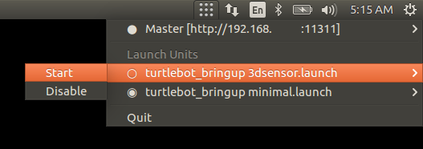
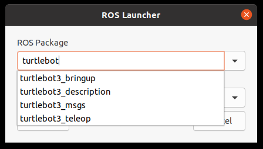
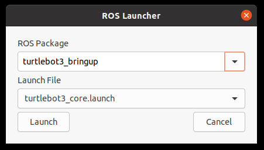

# ROS Robot Status Indicator
[](https://www.travis-ci.org/LucidOne/robot_indicator)
[](http://build.ros.org/view/Kbin_uX64/job/Kbin_uX64__robot_indicator__ubuntu_xenial_amd64__binary/)

[This](https://github.com/LucidOne/robot_indicator) package works with
[robot_systemd](https://github.com/LucidOne/robot_systemd) to provide a GUI for
Systemd based control of roslaunch units.






## TL;DR
```bash
mkdir -p ~/.config/autostart
cp `rospack find robot_indicator`/robot_indicator.desktop ~/.config/autostart/robot_indicator.desktop
rosrun robot_indicator robot_indicator
# or log out and log back in

# or as a service with robot_systemd
systemctl --user start roslaunch@robot_indicator:robot_indicator.service
```
